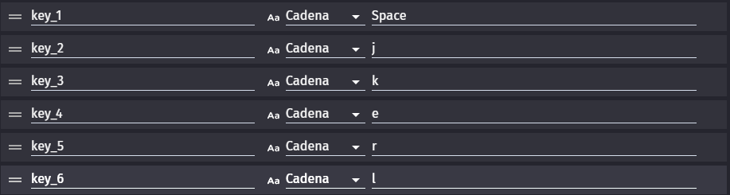

# Cosmic.JSON
## Qué hace este programa?
Este programa en python fue creado para poder cambiar unas condiciones por otras **en todos los eventos de todas las escenas** en el json de gdevelop, con la intención de reasignar los controles.

Consta de 2 modos.
	
### Modo 1

Este primer modo cumpliría la función de cambiar esta condición

Por esta otra:

Esto puede resultar útil ya que ahora puedes definir estas variables en tus globales del proyecto:

De esta manera puedes modificar cuanto quieras el valor de estas variables, consiguiendo así una manera fácil y óptima de reasignar los controles de tu juego

### Modo 2

Este segundo y último modo sirve para cambiar, por ejemplo, esta condición:

Por esta otra:

## Utilización

Para utilizar correctamente este programa debes cumplir una serie de requisitos:

### 1. Archivo JSON

Debes disponer de un archivo .json en la misma ruta en la que se encuentra cosmicjson.py cuando lo ejecutas.

### 2. Nombre de la tecla

Asegúrate de que el nombre de la tecla que introduzcas en cualquier parámetro de tecla sea una tecla que exista. Podría darse el caso, por ejemplo, de que introduzcas space en vez de Space, y eso haría que tu juego no funcionara correctamente.

### 3. Python instalado

Es necesario que tengas python instalado para poder ejecutar el programa

### 4. Permisos correctos

Es posible que el archivo .json el cual introduces como input no disponga de los permisos necesarios para que mi programa pueda abrir el archivo y leer su contenido. Asegúrate de que los permisos sean los correctos.

### 5. Modo correcto

Si introduces un modo que no se encuentra disponible, el programa no funcionará.

## Working on

En el futuro añadiré un tercer modo en el que podrás copiar una condición al portapapeles e indicar que quieres que sea sustituida por otra, la cual también copiarás al portapapeles y transmitirás como input al programa.

Made by: [cosmic3d](https://github.com/cosmic3d) 
